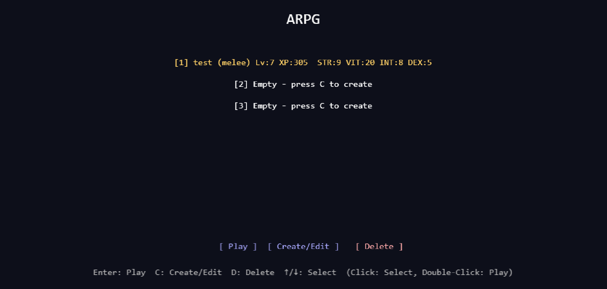
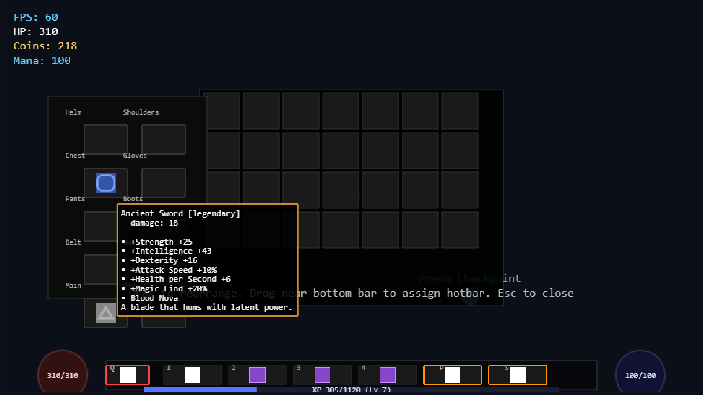
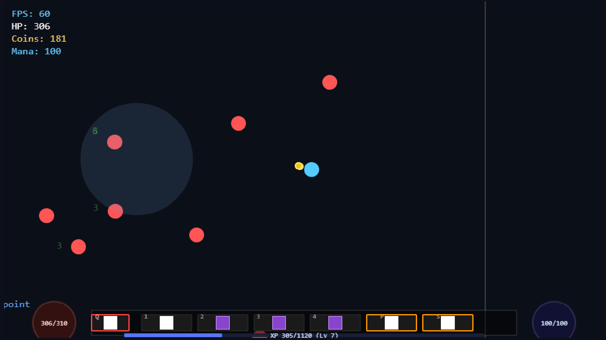

# ARPG

[](https://github.com/advocaite/arpg/actions)
[](https://github.com/advocaite/arpg/stargazers)
[](https://github.com/advocaite/arpg/network/members)
[](https://github.com/advocaite/arpg/watchers)
[](https://github.com/advocaite/arpg/blob/master/LICENSE)

## Overview

Phaser 3 action RPG with a data‑driven architecture:
- Modular powers/effects and AI brains
- Inventory, equipment, item qualities, and affixes (primary/secondary/legendary)
- Centralized drop system with coins, hearts, items, and Magic Find
- JSON‑driven content for skills, passives, items, affixes, sets, and worlds

## Quick Start

```bash
npm install
npm run redev   # stop → build → start dev server
```

Dev server: `http://127.0.0.1:5177/`

## Screenshots

<p>
  
  
</p>
<p>
  
  
</p>
<p>
  
</p>

## Key Systems

- Item qualities with colored tooltips and modular affixes
- Legendary affixes with support for proc‑based powers
- Equipment aggregation with dynamic stat updates on equip/unequip
- Unified kill→drop helper used by all powers (melee, AoE, lightning, thorns)
- Magic Find stat affecting drop and affix quality

## Build/Run Workflow

- Always stop running servers before building
- Use `npm run redev` to automate stop → build → dev


